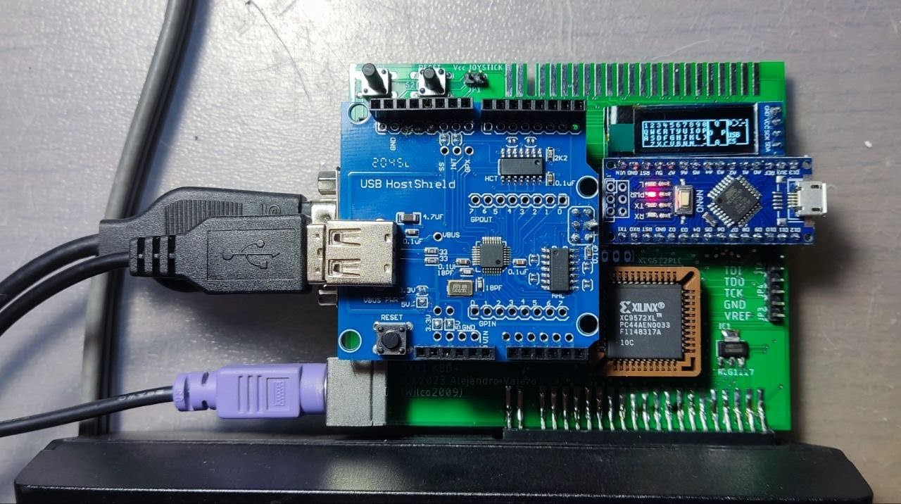
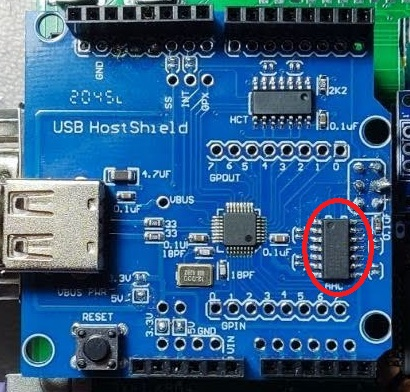

# ZX81KBD-PLUS
 Joystick, PS2 & USB keyboard interface for the ZX81
 
 
 
 COMPONENT LIST
 |  Component |  Quantity |
 | ------| --------| 
 | Arduino nano R3	1
 | Push Button 6x6 | 2
 | DB9 male	| 1
 | Mini DIN	9 PIN | 1
 | PCF8574P	| 1
 | USB Host Shield	| 1
 | OLED 128x32 I2C	| 1
 | XC9572XL-PLCC44	| 1
 | LM1117 3v3 regulator SOT223| 1
 | Res 100K	| 2
 | Res 4K7	| 8
 | DIP16 socket	| 1
 | PLCC44 socket (Though hole)	| 1
 | pin header male 1x40 | 1
 | pin header male 1x40 (long pins)	| 1
 | pin header female 1x40	| 2
 | 74AHC125D SOP14	| 1

##REPLACING THE USB HOST SHIELD CHIP
Unless we buy an original USB Host Shield from the official Arduino store, it is very likely that we will end up with a defective board from Aliexpress. The Chinese manufacturers have not strictly followed the original scheme and have used a 74HC125D instead of a 74AHC125D indicated in the original scheme.

The good news is that by replacing this chip it is very likely that we will have a fully functional board, the bad news is that we will have to desolder the old chip and solder the new one.
In the photo you can see the chip that needs to be replaced.
 

