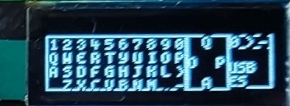

# ZX81KBD-PLUS
 Joystick, PS2 & USB keyboard interface for the ZX81
 
 
 
 ## INTERFACE COMPONENTS
 
 

 
 COMPONENT LIST
 |  Component |  Quantity |
 | ------| --------| 
 | Arduino nano R3	1
 | Push Button 6x6 | 2
 | DB9 male	| 1
 | Mini DIN	9 PIN | 1
 | PCF8574P	| 1
 | USB Host Shield	| 1
 | OLED 128x32 I2C	| 1
 | XC9572XL-PLCC44	| 1
 | LM1117 3v3 regulator SOT223| 1
 | Res 100K	| 2
 | Res 4K7	| 8
 | DIP16 socket	| 1
 | PLCC44 socket (Though hole)	| 1
 | pin header male 1x40 | 1
 | pin header male 1x40 (long pins)	| 1
 | pin header female 1x40	| 2
 | 74AHC125D SOP14	| 1
 
Once the interface is assembled, the first thing we have to do is program the arduino (using the arduino IDE) or the avrdude.
We must also program the CPLD using the Xilinx IMPACT program and connecting a programming cable to the JTAG connector.

## REPLACING THE USB HOST SHIELD CHIP
Unless we buy an original USB Host Shield from the official Arduino store, it is very likely that we will end up with a defective board from Aliexpress. The Chinese manufacturers have not strictly followed the original scheme and have used a 74HC125D instead of a 74AHC125D indicated in the original scheme.

The good news is that by replacing this chip it is very likely that we will have a fully functional board, the bad news is that we will have to desolder the old chip and solder the new one.
In the photo you can see the chip that needs to be replaced.

 
 

## MAIN SCREEN

The main screen of the OLED display is divided into two sections.
On the left we have a representation of the zx81 keyboard, and on the right a representation of the joystick with its three buttons (A B and FIRE)
When you press any key on the keyboard or any button on the joystick we will see the pressure on the display.
Additionally, in the joystick section we can see which keys are configured for each of the joystick buttons.

## INTERFACE CONFIGURATION

To enter the configuration menu we can do it in two ways:
- Pressing the configuration button
- Pressing F10 on the keyboard

Once inside the menu we can move through the options using the joystick or the keyboard cursor arrows. 
To select an option we will press the fire button on the joystick or the enter key on the keyboard.

### SELECTION OF KEYBOARD LAYOUT

The first option that appears when we access the menu is the one that will allow us to choose the keyboard layout.

The system is prepared for the following distributions:
- "US" - USA
- "UK" - United Kingdom
- "ES" - Spain
- "DE" - Germany

The active keyboard will be marked with an asterisk.
We can change the active keyboard with the up/down arrows on the keyboard or joystick and select with enter or the fire button.
The ESC key will return to the main menu.

### REDEFINING JOYSTICK KEYS

To redefine the joystick keys we will select the second option from the main menu by moving down with the arrow and press enter/fire.
After this, a screen identical to the main screen will appear but with the first joystick button to be redefined (UP) flashing.
We will select the key we want with the arrows in the left section of the screen and press ENTER or fire.
We can also directly press the key that we want to assign, except in the case of the cursor and enter keys, which would have to be selected by the first method mentioned.
By pressing the ESC or A key on the joystick we will go to the next button without modifying the current one.

